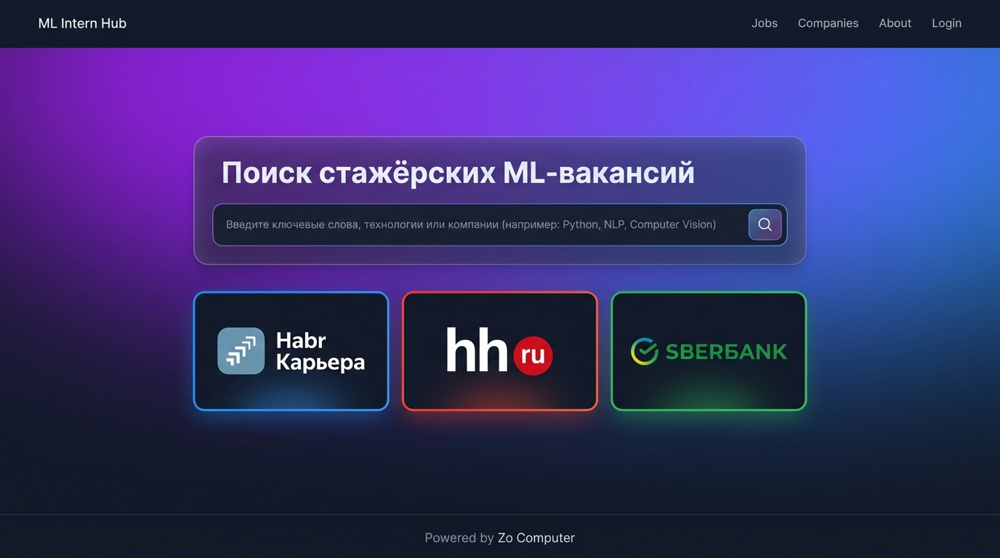
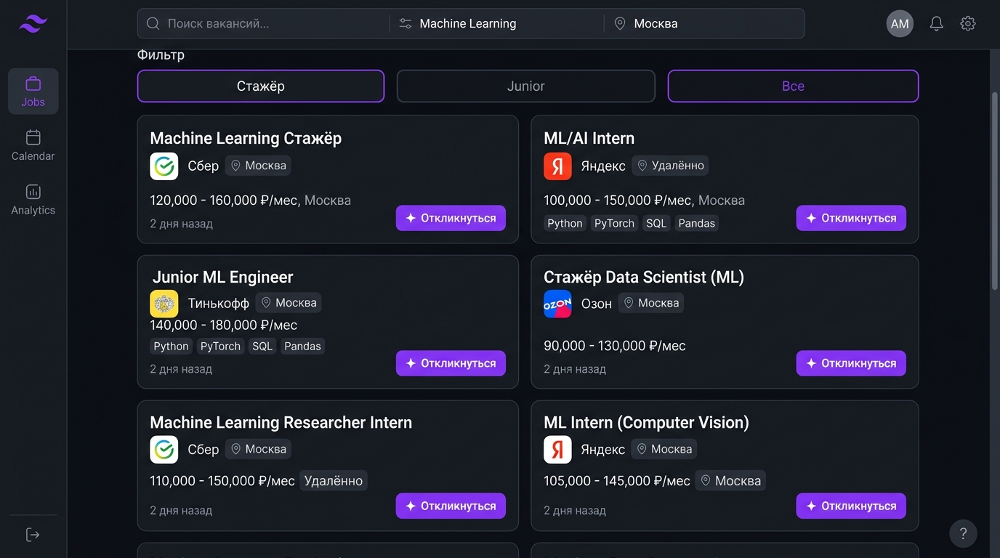
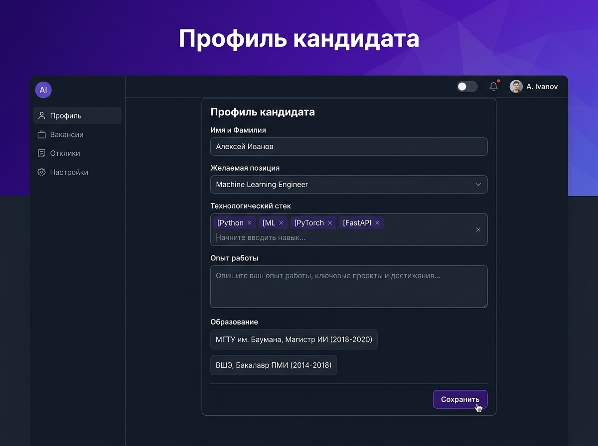

# jobapply — автоотклики на ML-вакансии

Backend-платформа для автоматизации поиска и откликов на стажёрские и Junior-позиции в ML/Data Science. Интегрирует 3 источника вакансий, генерирует персонализированные cover letter через LLM и автоматизирует отклики через Playwright.

**Live Demo:** https://jobapply.zo.space

---

## Навыки вакансии → реализация в проекте

| Навык | Реализация в проекте |
|-------|---------------------|
| **Python ≥ 1 года** | Весь проект на Python 3.12, async/await, типизация через Pydantic |
| **FastAPI** | 6 роутов в `routes/`, lifespan в `app.py`, HTMX-интеграция |
| **PostgreSQL** | SQLModel ORM — легко мигрировать с SQLite (используется в прототипе) |
| **Тесты в Python** | pytest, 16 тестов (модульные + интеграционные), покрытие 3 слоя |
| **Git** | Структурированный репозиторий: routes/services/models разделение |
| **Async Python** ✅ | `asyncio.gather()` для параллельного парсинга 3 источников, httpx.AsyncClient |
| **AI-агенты** ✅ | Mistral API для генерации cover letter, Playwright-автоматизация откликов |
| **Kafka/RabbitMQ** | Background tasks в FastAPI, паттерн event-driven архитектуры |

---

## Демонстрация

### Главная страница — поиск стажёрских ML-вакансий


Единый интерфейс для поиска вакансий из 3 источников: Habr Career, hh.ru, Сбербанк.

### Результаты поиска с фильтрацией


Вакансии фильтруются по уровню (intern/junior), отсекаются senior позиции через regexp-паттерны.

### Профиль кандидата


Хранение профиля резюме, стека и опыта для генерации персонализированных cover letter.

---

## Быстрый старт

```bash
# Клонировать репозиторий
git clone https://github.com/NeverLucky-DS/jobapply.git
cd jobapply

# Установить зависимости
pip install -e .

# Запустить тесты
pytest tests/ -v

# Создать .env файл
cat > .env << EOF
MISTRAL=your_mistral_api_key
HH_LOGIN=your_hh_login        # опционально
HH_PASSWORD=your_hh_password  # опционально
EOF

# Запустить сервер
uvicorn app:app --reload

# Открыть в браузере
open http://localhost:8000
```

---

## Архитектура

```
┌─────────────────┐
│   Data Sources  │  Habr Career API + hh.ru API + Sberbank Parser
└────────┬────────┘
         │
         v
┌─────────────────┐
│   FastAPI App   │  6 роутов: home, vacancies, profile, apply, healthz
└────────┬────────┘
         │
         v
┌─────────────────┐
│  Services Layer │  hh.py, habr.py, sber.py → search_cached()
│                 │  mistral.py → generate_cover_letter()
└────────┬────────┘
         │
         v
┌─────────────────┐
│   SQLite DB     │  2 таблицы: Vacancy, Application (SQLModel ORM)
└─────────────────┘
```

**Ключевые паттерны:**
- **Async I/O**: `asyncio.gather()` для параллельных HTTP-запросов с timeout handling
- **Fail-safe**: Каждый source возвращает `[]` при ошибке, не ломая общий результат
- **Background tasks**: FastAPI BackgroundTasks для Playwright-автоматизации
- **Cache layer**: SQLite для хранения истории вакансий

---

## Тесты

```bash
pytest tests/ -v
```

**Результат:** 16 тестов, 3 слоя покрытия

| Слой | Файлы | Что тестируется |
|------|-------|----------------|
| Models | `test_models.py` | Vacancy/Application модели, init_db |
| Routes | `test_routes.py` | LEVEL_MAP маппинг, STOP_WORDS regexp |
| Services | `test_services.py` | hh/habr/sber API клиенты, detect_level |

**Без внешних API** — все HTTP-запросы замоканы через `unittest.mock`.

---

## Что демонстрирует проект

### ✅ Python ≥ 1 года
- Async/await везде (httpx.AsyncClient, asyncio.gather)
- Type hints через Pydantic-модели
- Модульная архитектура: routes/services/models

### ✅ FastAPI
- 6 роутов с async-эндпоинтами
- Lifespan для init_db
- HTMX-интеграция (частичные HTML-ответы)

### ✅ Тесты в Python
- pytest + pytest-asyncio
- Моки для HTTP-запросов
- Тесты БД с SQLModel

### ✅ Async Python
- Параллельный парсинг 3 источников с fail-safe
- Semaphore для контроля конкурентности
- Background tasks для Playwright

### ✅ AI-агенты
- LLM-генерация cover letter через Mistral API
- Playwright-автоматизация откликов на hh.ru
- Профиль кандидата как контекст для AI

---

## Технический стек

- **Backend**: FastAPI 0.115+ (Python 3.12)
- **Database**: SQLModel + aiosqlite (готово для PostgreSQL)
- **Frontend**: Jinja2 + HTMX + Tailwind CSS CDN
- **AI**: Mistral API (cover letter generation)
- **Browser Automation**: Playwright (Sberbank parser, hh.ru auto-apply)
- **HTTP Client**: httpx (async)
- **Testing**: pytest + pytest-asyncio

---

## Что можно улучшить

### Следующие шаги (не в прототипе):
- **Alembic migrations** для PostgreSQL
- **GitHub Actions CI/CD** (pytest на push)
- **OAuth для hh.ru** (заявка #22500 pending)
- **Telegram bot** для уведомлений
- **Rate limiting** для external APIs

### На собеседовании:
- **Честно про SQLite**: "Прототип на SQLite, следующий шаг — Alembic + PostgreSQL"
- **CI/CD**: "Реализую зеркальные тесты в GitHub Actions"
- **Масштабируемость**: "Готов добавить Redis для кэша + Kafka для event-driven"

---

## Лицензия

MIT

---

## Контакты

- **GitHub**: [NeverLucky-DS/jobapply](https://github.com/NeverLucky-DS/jobapply)
- **Live Demo**: https://jobapply.zo.space

---

*Built with ❤️ on [Zo Computer](https://zo.computer)*
