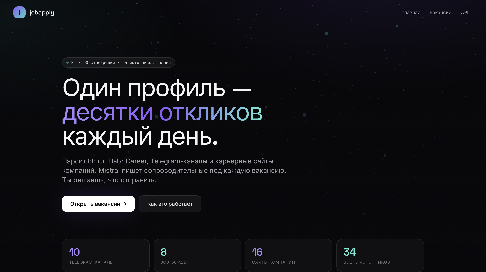
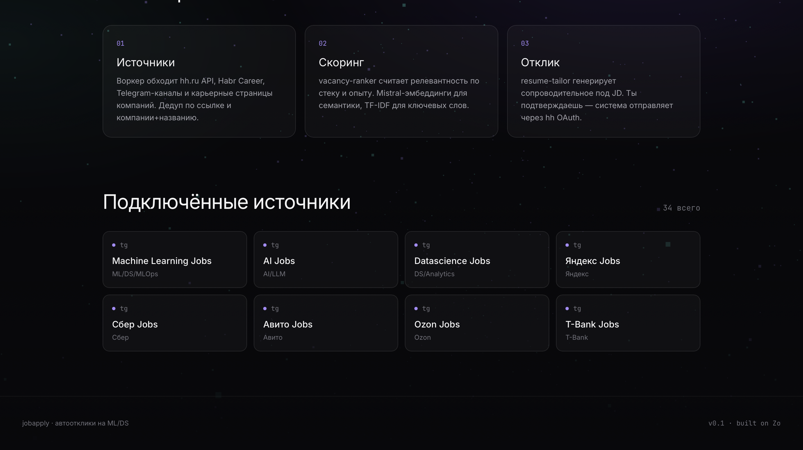
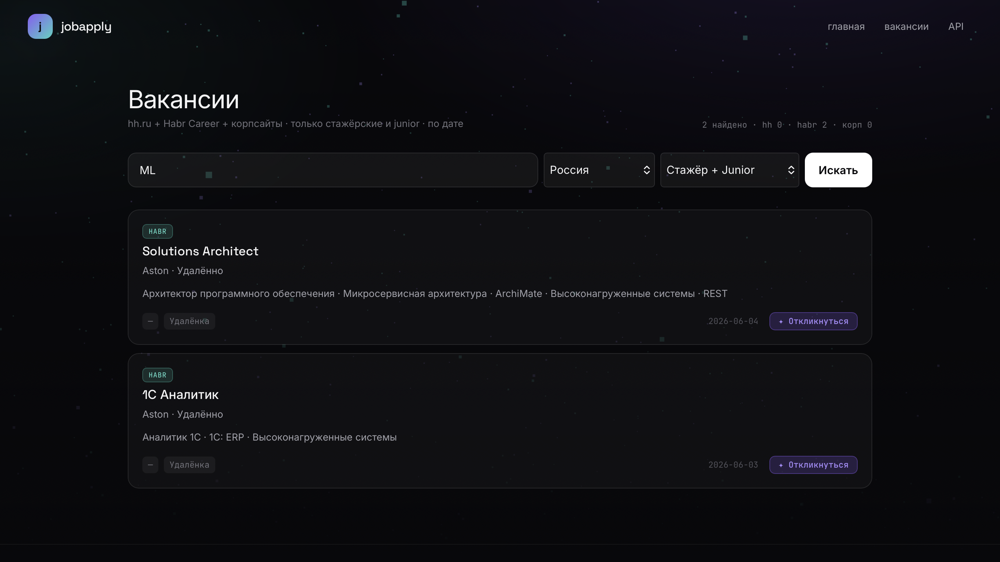
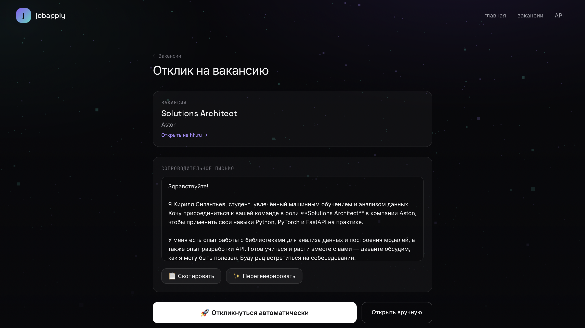

# jobapply — LLM-агент для ML/DS вакансий

Автоматизация поиска и откликов на стажировки в **ML / Data Science**: multi-source fetch → фильтр intern/junior → **Mistral** cover letter → Playwright на hh.ru.

| Направление | Реализация |
|-------------|------------|
| LLM | Mistral — персонализированное сопроводительное под профиль и вакансию |
| Agent loop | perceive → filter → generate → act (browser) |
| Данные | SQLite cache вакансий, лог откликов `Application` |
| Сервинг | FastAPI, HTMX, BackgroundTasks |
| Async | `asyncio.gather` (hh + Habr + cache), Playwright async |
| Тесты | pytest — 16 тестов, mock внешних API |

## Архитектура

```
sources (habr/hh/sber) → filter (level) → mistral (letter) → applier (browser)
                                       ↓
                                  SQLite log
```


## Скриншоты

### Главная страница — поиск ML-вакансий


### Результаты поиска


### Фильтрация по уровню


### Генерация cover letter


## Стек

- FastAPI + SQLModel + async SQLite
- Mistral API (cover letter generation)
- Playwright (browser automation)
- Jinja2 + HTMX
- pytest + pytest-asyncio

## Структура проекта

```
jobapply/
├── app.py              # FastAPI entrypoint
├── models.py           # SQLModel models
├── db.py               # Async SQLite engine
├── routes/
│   ├── home.py         # Landing page
│   ├── vacancies.py    # Search vacancies
│   ├── profile.py      # Candidate profile
│   └── apply.py        # Auto-apply
├── services/
│   ├── hh.py           # hh.ru API client
│   ├── habr.py         # Habr Career API client
│   ├── sber.py         # Sber Playwright parser
│   ├── mistral.py      # Cover letter generation
│   └── applier.py      # Playwright auto-apply
├── tests/
│   ├── test_models.py
│   ├── test_routes.py
│   └── test_services.py
├── web/
│   ├── templates/      # Jinja2 templates
│   └── static/         # CSS, JS
└── screenshots/        # Product screenshots
```

## Установка

```bash
# Клонировать репозиторий
git clone https://github.com/NeverLucky-DS/jobapply.git
cd jobapply

# Создать виртуальное окружение
python -m venv .venv
source .venv/bin/activate

# Установить зависимости
pip install -e .

# Установить Playwright браузер
playwright install chromium

# Создать .env файл
cat > .env << EOF
MISTRAL=your_mistral_api_key
HH_LOGIN=your_hh_login        # опционально
HH_PASSWORD=your_hh_password  # опционально
EOF

# Запустить тесты
pytest tests/ -v

# Запустить сервер
uvicorn app:app --reload
```

## Тесты

```bash
pytest tests/ -v
```

Результат: 16 passed in 0.54s

Покрытие:
- test_models.py: 4 теста (Vacancy/Application модели)
- test_routes.py: 5 тестов (роуты, regexp-паттерны)
- test_services.py: 7 тестов (HH/Habr/Mistral, Sber parser)

## API источники

| Источник | Метод | Ограничения |
|----------|-------|-------------|
| Habr Career | REST API | Без ограничений |
| hh.ru | REST API | Нужен OAuth (заявка pending) |
| Сбербанк | Playwright | SPA, рендерится браузером |

## Конфигурация

Все секреты в `.env`:

| Переменная | Описание |
|------------|----------|
| MISTRAL | API-ключ Mistral AI |
| HH_LOGIN | Логин hh.ru (для Playwright auto-apply) |
| HH_PASSWORD | Пароль hh.ru |

## Next Steps

1. PostgreSQL migration (Alembic + asyncpg)
2. OAuth для hh.ru API (заявка #22500)
3. Kafka для очереди откликов
4. Docker Compose deploy
5. Prometheus + Grafana monitoring

## Лицензия

MIT
